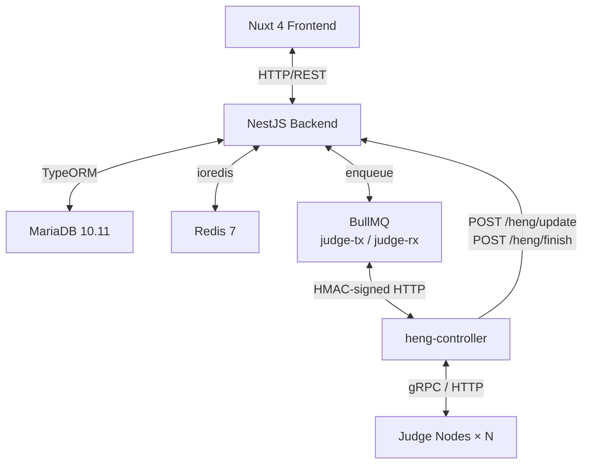
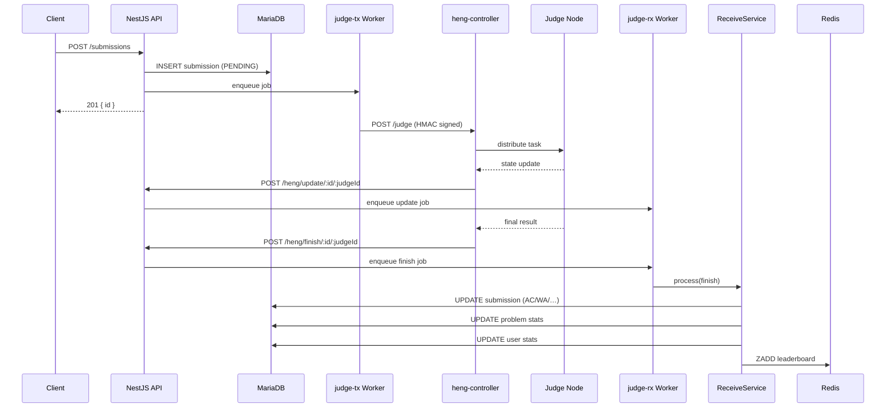

# Architecture

## System Overview



### Component Responsibilities

| Component | Role |
|-----------|------|
| **NestJS Backend** | REST API, business logic, queue producer/consumer |
| **MariaDB** | Persistent storage (users, problems, submissions, contests, …) |
| **Redis** | Session cache, leaderboard Sorted Sets, rate-limit counters |
| **BullMQ** | Async job queues (`judge-tx` for sending, `judge-rx` for receiving) |
| **heng-controller** | Judge orchestrator — distributes tasks to judge nodes |
| **Judge Nodes** | Sandboxed execution environments |

---

## Module Reference

### `auth`
JWT-based authentication with a **dual-token** strategy:
- `access token` — short-lived (15 min, HS256, `JWT_ACCESS_SECRET`)
- `refresh token` — long-lived (7 days, `JWT_REFRESH_SECRET`)

Contest users share the same token infrastructure but receive a separate `access token` scoped to the contest via `POST /auth/login/contest`.

Guards: `JwtAuthGuard` (verifies access token) → `RolesGuard` (checks role weight).

### `problem`
Problem CRUD. Non-admin users see only visible problems. `findOne` responses are cached in Redis for 6 seconds to absorb burst reads during contests. Tag-based filtering is supported.

### `submission`
Handles code submission with:
- **Rate limit** — configurable via `MAX_SUBMISSION_PER_MINUTE` (default 10/min, enforced per user via Redis)
- **Language bonus** — `LANGUAGE_BONUS` multiplier applies extra time/memory for certain languages
- On creation, writes a `PENDING` record to DB, then enqueues a job to `judge-tx`

### `heng`
Bridge between the backend and `heng-controller`:
- **`judge-tx` Worker** — dequeues submission jobs, signs the request with HMAC (`HENG_AK`/`HENG_SK`), sends to `heng-controller`
- **`judge-rx` Worker** — processes callbacks pushed by `HengController` into the `judge-rx` queue

### `receive`
Consumes `judge-rx` jobs (final results). Responsibilities:
- Update `Submission` record (status, time, memory, judge detail)
- Update `Problem` statistics (AC count, submit count)
- Update `User` statistics
- Update Redis leaderboard(s) — global rank, contest rank, course rank

### `rank`
Global leaderboard backed by a Redis Sorted Set.  
Score formula: `AC_count × 1_000_000_000 - penalty_seconds`  
Higher score = better rank. Operations: `ZADD`, `ZREVRANK`, `ZREVRANGE`.

### `contest`
Contest management with:
- Real-time ranking via Redis Sorted Set (same score formula as `rank`)
- **Balloon tracking** — first AC on a problem per user generates a balloon record; supervisors mark delivery via `PATCH /contests/:id/balloons/:bid`
- Separate contest user accounts (bulk import with random passwords)

### `course`
Course management with student enrollment.  
`GET /courses/:id/submissions/export` supports three filter modes: exact match, range, and regex — useful for homework grading.

### `user`
User CRUD with:
- **PBKDF2** password hashing (Node.js built-in `crypto`)
- **Bulk import** via CSV/JSON (`POST /users/import`)
- **`canManage` weight check** — a user can only manage accounts with equal or lower privilege weight

### `compete`
Bot battle system with three entities:
- `Game` — defines a game type (problem + rules)
- `Gamer` — a user's bot (code + metadata)
- `Match` — a recorded battle between two gamers

### `media`
File upload service. Validates both file extension and MIME type before accepting. Used primarily for problem test data (`.zip`).

### `metrics`
Exposes a Prometheus-compatible `/metrics` endpoint using `@willsoto/nestjs-prometheus`.

### `health`
Liveness/readiness endpoint at `/health`. Checks DB and Redis connectivity.

---

## Judge Pipeline (Detailed)

### Flow Description

1. User calls `POST /submissions` with code + language + problem ID
2. Backend writes a `PENDING` submission to MariaDB
3. A job is enqueued into the `judge-tx` BullMQ queue
4. The `JudgeTxWorker` picks up the job:
   - Fetches problem test data reference
   - Signs the request body with HMAC-SHA256 (`HENG_AK` + `HENG_SK`)
   - POSTs to `heng-controller`
5. `heng-controller` distributes the task to an available judge node
6. Judge node runs the code in a sandbox and streams state updates back
7. `heng-controller` sends intermediate callbacks to `POST /heng/update/:submissionId/:judgeId`
8. `heng-controller` sends the final result to `POST /heng/finish/:submissionId/:judgeId`
9. `HengController` receives each callback and pushes it into the `judge-rx` queue (async decoupling)
10. The `JudgeRxWorker` consumes the job and calls `ReceiveService`
11. `ReceiveService` updates the DB record, problem stats, user stats, and all relevant Redis leaderboards

### Sequence Diagram



---

## Authentication System

### Token Lifecycle

```
POST /auth/login
  → returns { accessToken (15m), refreshToken (7d) }

POST /auth/refresh
  → { refreshToken } → returns { accessToken (15m) }

POST /auth/logout
  → client discards tokens (stateless; blacklist is a planned feature)
```

### Guard Stack

```
Request
  └─ JwtAuthGuard         (validates access token, sets req.user)
       └─ RolesGuard      (checks user.role weight ≤ required weight)
```

Role weights (lower = more privileged):

| Role | Weight |
|------|--------|
| `sa` | 0 |
| `admin` | 1 |
| `supervisor` | 2 |
| `user` | 3 |
| `contest-user` | 4 |
| `guest` | 5 |

`RolesGuard` uses `@Roles('admin')` decorator which resolves to "weight ≤ 1", so `sa` also passes.

### Contest Auth

Contest users authenticate via `POST /auth/login/contest` with `contestId + username + password`. They receive a short-lived access token that is scoped to the contest context. The same `JwtAuthGuard` validates this token; the contest ID embedded in the payload is used for authorization checks downstream.
