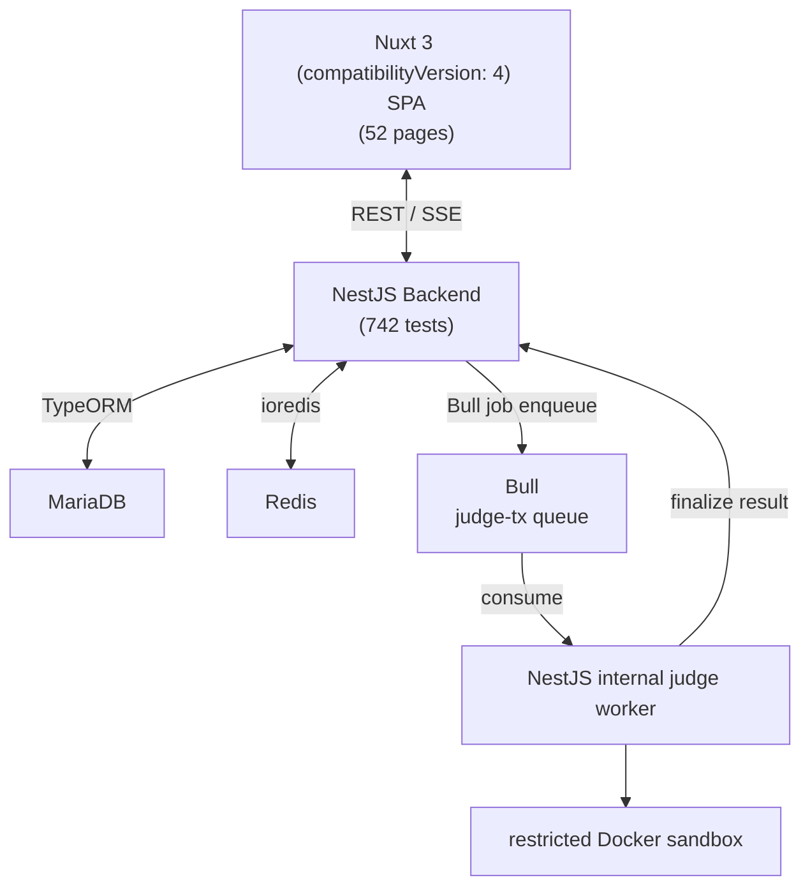

# Architecture

## System Overview

### Component Responsibilities

| Component | Role |
|-----------|------|
| **Nuxt 3 (compatibilityVersion: 4) SPA** | Frontend — 52 pages, Naive UI, SPA mode (SSR disabled) |
| **NestJS Backend** | REST API, business logic, Bull queue producer/consumer |
| **MariaDB** | Persistent storage (users, gamers, matches, ELO history, …) |
| **Redis** | Queue storage (Bull), session cache, rate-limit counters |
| **Bull** | Async job queue (`judge-tx`) for match submission |
| **Internal judge worker** | Consumes OJ and match jobs; finalizes results in the same NestJS backend |
| **Docker sandbox** | Restricts compilation and execution of submitted code |

---

## Module Reference

### `auth`
JWT-based authentication with dual-token strategy:
- `access token` — short-lived (15 min, HS256, `JWT_ACCESS_SECRET`)
- `refresh token` — long-lived (7 days, `JWT_REFRESH_SECRET`)

Also supports **X-API-Key** header with user-generated API keys (`lev_` prefix, SHA256 stored).

Guards: `JwtAuthGuard` (verifies access token or API key) → `RolesGuard` (checks role weight).

### `compete`
Core module for bot competition:

- **Game** — judge code, renderer HTML, time/memory limits, player count
- **Gamer** — bot registration (code, language, type: code/webhook/human/external)
- **Match** — lifecycle: PENDING → RUNNING → FINISHED / ERROR
- **ELO** — per-game ELO ratings with full history in `gamer_elo_history`
- **Auto-match scheduler** — adaptive backoff cron, runs matches for enabled games

### `judge-runtime`
`InternalJudgeService` queues OJ submissions and Botzone matches; the Nest worker executes them in a restricted Docker sandbox and settles results locally. Public webhook bots remain supported as match participants.

### `mcp`
13-tool MCP server exposing Leverage as AI-callable tools.
See [`MCP_SETUP.md`](./MCP_SETUP.md) for setup and [`GAME_DESIGN.md`](./GAME_DESIGN.md) for judge/bot protocol.

---

## Key Design Decisions

### Fork-on-Edit
Bots are **immutable after creation**. Editing creates a new `Gamer` row — the original keeps its ELO history. This preserves leaderboard integrity.

### User-Submitted Judges
Game judges are Python/JS programs uploaded by supervisors. The internal worker compiles them in the sandbox and exchanges round data via stdin/stdout.

### API Key Authentication
Users can generate `lev_` prefixed API keys for external bot integration:
- Stored as SHA256 hash (plaintext shown only once at creation)
- Accepted via `X-API-Key` header in JwtAuthGuard

### Renderer Isolation
Game renderers are user-uploaded HTML files loaded in sandboxed iframes (`sandbox="allow-scripts"`). They communicate with the host page exclusively via `postMessage` with `type: "gameLog"`.

---

## Database Schema (Key Tables)

| Table | Purpose |
|-------|---------|
| `user` | Auth, roles |
| `game` | Game definition (judge, renderer, limits) |
| `gamer` | Bot registrations |
| `match` | Match lifecycle + result JSON |
| `match_gamer_link` | Many-to-many: match ↔ gamer, with position index |
| `gamer_elo_history` | ELO snapshots per match |
| `user_api_key` | User API keys (hashed) |
